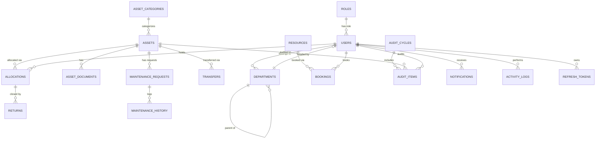

# Database Schema — Source of Truth

PostgreSQL. All migrations via Flyway (`src/main/resources/db/migration/V{n}__{desc}.sql`).
Never rely on Hibernate `ddl-auto` beyond `validate` in any environment past local
scratch work — the migration files are the schema's source of truth.

Every table below implicitly includes, unless noted:

```sql
id           BIGSERIAL PRIMARY KEY,
created_at   TIMESTAMPTZ NOT NULL DEFAULT now(),
updated_at   TIMESTAMPTZ NOT NULL DEFAULT now(),
created_by   BIGINT REFERENCES users(id),
updated_by   BIGINT REFERENCES users(id),
status       VARCHAR(20) NOT NULL DEFAULT 'ACTIVE'  -- ACTIVE / INACTIVE
```

## Table list (build in this order — respects FK dependencies)

1. `roles`
2. `users`
3. `departments`
4. `asset_categories`
5. `assets`
6. `asset_documents`
7. `allocations`
8. `transfers`
9. `returns`
10. `resources`
11. `bookings`
12. `maintenance_requests`
13. `maintenance_history`
14. `audit_cycles`
15. `audit_items`
16. `notifications`
17. `activity_logs`
18. `refresh_tokens`

## Table definitions

### roles
```sql
CREATE TABLE roles (
    id          BIGSERIAL PRIMARY KEY,
    name        VARCHAR(50) NOT NULL UNIQUE,   -- ADMIN, ASSET_MANAGER, DEPT_HEAD, EMPLOYEE
    description VARCHAR(255)
);
```
Seed via Flyway: the four roles above.

### users
```sql
CREATE TABLE users (
    id            BIGSERIAL PRIMARY KEY,
    name          VARCHAR(120) NOT NULL,
    email         VARCHAR(160) NOT NULL UNIQUE,
    password_hash VARCHAR(255) NOT NULL,
    role_id       BIGINT NOT NULL REFERENCES roles(id),
    dept_id       BIGINT REFERENCES departments(id),
    status        VARCHAR(20) NOT NULL DEFAULT 'ACTIVE',
    created_at    TIMESTAMPTZ NOT NULL DEFAULT now(),
    updated_at    TIMESTAMPTZ NOT NULL DEFAULT now()
);
CREATE INDEX idx_users_email ON users(email);
CREATE INDEX idx_users_dept_id ON users(dept_id);
```
Note: `users.dept_id` FK to `departments` creates a circular dependency with
`departments.head_id` FK to `users`. Resolve by creating `users` first without
the `dept_id` FK enforced (nullable, added as a separate `ALTER TABLE ... ADD
CONSTRAINT` migration after `departments` exists), or create both tables and add
both FKs in a third migration. Do not skip either FK.

### departments
```sql
CREATE TABLE departments (
    id         BIGSERIAL PRIMARY KEY,
    name       VARCHAR(120) NOT NULL,
    parent_id  BIGINT REFERENCES departments(id),
    head_id    BIGINT REFERENCES users(id),
    status     VARCHAR(20) NOT NULL DEFAULT 'ACTIVE',
    created_at TIMESTAMPTZ NOT NULL DEFAULT now(),
    updated_at TIMESTAMPTZ NOT NULL DEFAULT now()
);
CREATE INDEX idx_departments_parent_id ON departments(parent_id);
```
Cycle prevention (A is parent of B, B is parent of A) is NOT enforced by the DB —
enforce in `DepartmentService` by walking the parent chain before save and
rejecting if the new parent's ancestry includes the department itself.

### asset_categories
```sql
CREATE TABLE asset_categories (
    id               BIGSERIAL PRIMARY KEY,
    name             VARCHAR(120) NOT NULL UNIQUE,
    description      VARCHAR(500),
    warranty_months  INTEGER,
    status           VARCHAR(20) NOT NULL DEFAULT 'ACTIVE',
    created_at       TIMESTAMPTZ NOT NULL DEFAULT now(),
    updated_at       TIMESTAMPTZ NOT NULL DEFAULT now(),
    created_by       BIGINT REFERENCES users(id),
    updated_by       BIGINT REFERENCES users(id)
);
```

### assets
```sql
CREATE TABLE assets (
    id             BIGSERIAL PRIMARY KEY,
    asset_tag      VARCHAR(50) NOT NULL UNIQUE,
    serial_no      VARCHAR(100) UNIQUE,
    name           VARCHAR(160) NOT NULL,
    category_id    BIGINT NOT NULL REFERENCES asset_categories(id),
    location       VARCHAR(160),
    purchase_date  DATE,
    cost           NUMERIC(12,2),
    condition      VARCHAR(30),
    status         VARCHAR(30) NOT NULL DEFAULT 'AVAILABLE',
        -- AVAILABLE / ALLOCATED / RESERVED / UNDER_MAINTENANCE / RETIRED / DISPOSED / INACTIVE
    bookable       BOOLEAN NOT NULL DEFAULT false,
    created_at     TIMESTAMPTZ NOT NULL DEFAULT now(),
    updated_at     TIMESTAMPTZ NOT NULL DEFAULT now(),
    created_by     BIGINT REFERENCES users(id),
    updated_by     BIGINT REFERENCES users(id)
);
CREATE INDEX idx_assets_category_id ON assets(category_id);
CREATE INDEX idx_assets_status ON assets(status);
```
Note: `assets.status` is the **asset lifecycle** status (see state machine in
`04-BUSINESS-RULES.md`) — distinct in meaning from the generic
`ACTIVE`/`INACTIVE` audit-status column used on most other tables. Do not conflate
the two; `assets` does not use the generic ACTIVE/INACTIVE status column at all,
its `status` column IS the lifecycle field, and "soft delete" for an asset means
transitioning it to `RETIRED`/`DISPOSED`, not a separate flag.

### asset_documents
```sql
CREATE TABLE asset_documents (
    id          BIGSERIAL PRIMARY KEY,
    asset_id    BIGINT NOT NULL REFERENCES assets(id),
    file_name   VARCHAR(255) NOT NULL,
    file_url    VARCHAR(500) NOT NULL,
    uploaded_by BIGINT REFERENCES users(id),
    created_at  TIMESTAMPTZ NOT NULL DEFAULT now()
);
CREATE INDEX idx_asset_documents_asset_id ON asset_documents(asset_id);
```

### allocations
```sql
CREATE TABLE allocations (
    id              BIGSERIAL PRIMARY KEY,
    asset_id        BIGINT NOT NULL REFERENCES assets(id),
    user_id         BIGINT NOT NULL REFERENCES users(id),
    allocated_by    BIGINT NOT NULL REFERENCES users(id),
    start_date      DATE NOT NULL,
    expected_return DATE,
    status          VARCHAR(20) NOT NULL DEFAULT 'ACTIVE', -- ACTIVE / RETURNED
    created_at      TIMESTAMPTZ NOT NULL DEFAULT now(),
    updated_at      TIMESTAMPTZ NOT NULL DEFAULT now()
);
CREATE INDEX idx_allocations_asset_id ON allocations(asset_id);
CREATE INDEX idx_allocations_user_id ON allocations(user_id);
-- Enforce "one active allocation per asset" at the DB level as a backstop:
CREATE UNIQUE INDEX uq_allocations_one_active_per_asset
    ON allocations(asset_id) WHERE status = 'ACTIVE';
```
The partial unique index is the DB-level backstop referenced in
`04-BUSINESS-RULES.md`; the service-level check is what produces the friendly
error message — both must exist.

### transfers
```sql
CREATE TABLE transfers (
    id             BIGSERIAL PRIMARY KEY,
    asset_id       BIGINT NOT NULL REFERENCES assets(id),
    from_user_id   BIGINT NOT NULL REFERENCES users(id),
    to_user_id     BIGINT NOT NULL REFERENCES users(id),
    requested_by   BIGINT NOT NULL REFERENCES users(id),
    request_date   TIMESTAMPTZ NOT NULL DEFAULT now(),
    status         VARCHAR(20) NOT NULL DEFAULT 'PENDING', -- PENDING / APPROVED / REJECTED
    created_at     TIMESTAMPTZ NOT NULL DEFAULT now(),
    updated_at     TIMESTAMPTZ NOT NULL DEFAULT now()
);
CREATE INDEX idx_transfers_asset_id ON transfers(asset_id);
```

### returns
```sql
CREATE TABLE returns (
    id             BIGSERIAL PRIMARY KEY,
    allocation_id  BIGINT NOT NULL REFERENCES allocations(id),
    returned_by    BIGINT NOT NULL REFERENCES users(id),
    return_date    DATE NOT NULL,
    condition      VARCHAR(30),
    created_at     TIMESTAMPTZ NOT NULL DEFAULT now()
);
CREATE INDEX idx_returns_allocation_id ON returns(allocation_id);
```

### resources
```sql
CREATE TABLE resources (
    id          BIGSERIAL PRIMARY KEY,
    name        VARCHAR(120) NOT NULL UNIQUE,
    description VARCHAR(500),
    location    VARCHAR(160),
    status      VARCHAR(20) NOT NULL DEFAULT 'ACTIVE',
    created_at  TIMESTAMPTZ NOT NULL DEFAULT now(),
    updated_at  TIMESTAMPTZ NOT NULL DEFAULT now()
);
```

### bookings
```sql
CREATE TABLE bookings (
    id          BIGSERIAL PRIMARY KEY,
    resource_id BIGINT NOT NULL REFERENCES resources(id),
    user_id     BIGINT NOT NULL REFERENCES users(id),
    start_time  TIMESTAMPTZ NOT NULL,
    end_time    TIMESTAMPTZ NOT NULL,
    status      VARCHAR(20) NOT NULL DEFAULT 'CONFIRMED', -- PENDING / CONFIRMED / CANCELLED / COMPLETED
    created_at  TIMESTAMPTZ NOT NULL DEFAULT now(),
    updated_at  TIMESTAMPTZ NOT NULL DEFAULT now(),
    CONSTRAINT chk_booking_time_order CHECK (end_time > start_time)
);
CREATE INDEX idx_bookings_resource_time ON bookings(resource_id, start_time, end_time);
```
The `(resource_id, start_time, end_time)` composite index is what makes the
overlap-check query in `04-BUSINESS-RULES.md` efficient — this is the single
most important index in the schema for demo performance, since the overlap
check runs on every booking write.

### maintenance_requests
```sql
CREATE TABLE maintenance_requests (
    id           BIGSERIAL PRIMARY KEY,
    asset_id     BIGINT NOT NULL REFERENCES assets(id),
    requested_by BIGINT NOT NULL REFERENCES users(id),
    description  VARCHAR(1000),
    priority     VARCHAR(20) NOT NULL DEFAULT 'MEDIUM', -- LOW / MEDIUM / HIGH
    status       VARCHAR(20) NOT NULL DEFAULT 'PENDING',
        -- PENDING / APPROVED / IN_PROGRESS / RESOLVED / CLOSED
    created_at   TIMESTAMPTZ NOT NULL DEFAULT now(),
    updated_at   TIMESTAMPTZ NOT NULL DEFAULT now()
);
CREATE INDEX idx_maintenance_requests_asset_id ON maintenance_requests(asset_id);
CREATE INDEX idx_maintenance_requests_status ON maintenance_requests(status);
```

### maintenance_history
```sql
CREATE TABLE maintenance_history (
    id          BIGSERIAL PRIMARY KEY,
    request_id  BIGINT NOT NULL REFERENCES maintenance_requests(id),
    status      VARCHAR(20) NOT NULL,
    updated_by  BIGINT NOT NULL REFERENCES users(id),
    comment     VARCHAR(500),
    created_at  TIMESTAMPTZ NOT NULL DEFAULT now()
);
CREATE INDEX idx_maintenance_history_request_id ON maintenance_history(request_id);
```

### audit_cycles
```sql
CREATE TABLE audit_cycles (
    id         BIGSERIAL PRIMARY KEY,
    title      VARCHAR(160) NOT NULL,
    start_date DATE NOT NULL,
    end_date   DATE,
    created_by BIGINT NOT NULL REFERENCES users(id),
    status     VARCHAR(20) NOT NULL DEFAULT 'OPEN', -- OPEN / CLOSED
    created_at TIMESTAMPTZ NOT NULL DEFAULT now(),
    updated_at TIMESTAMPTZ NOT NULL DEFAULT now()
);
```

### audit_items
```sql
CREATE TABLE audit_items (
    id          BIGSERIAL PRIMARY KEY,
    audit_id    BIGINT NOT NULL REFERENCES audit_cycles(id),
    asset_id    BIGINT NOT NULL REFERENCES assets(id),
    auditor_id  BIGINT NOT NULL REFERENCES users(id),
    result      VARCHAR(20), -- PENDING / VERIFIED / MISSING / DAMAGED
    remarks     VARCHAR(500),
    created_at  TIMESTAMPTZ NOT NULL DEFAULT now(),
    updated_at  TIMESTAMPTZ NOT NULL DEFAULT now()
);
CREATE INDEX idx_audit_items_audit_id ON audit_items(audit_id);
CREATE INDEX idx_audit_items_asset_id ON audit_items(asset_id);
```

### notifications
```sql
CREATE TABLE notifications (
    id         BIGSERIAL PRIMARY KEY,
    user_id    BIGINT NOT NULL REFERENCES users(id),
    type       VARCHAR(50) NOT NULL,
    message    VARCHAR(500) NOT NULL,
    is_read    BOOLEAN NOT NULL DEFAULT false,
    created_at TIMESTAMPTZ NOT NULL DEFAULT now()
);
CREATE INDEX idx_notifications_user_unread ON notifications(user_id, is_read);
```

### activity_logs
```sql
CREATE TABLE activity_logs (
    id         BIGSERIAL PRIMARY KEY,
    user_id    BIGINT REFERENCES users(id),
    module     VARCHAR(50) NOT NULL,
    action     VARCHAR(80) NOT NULL,
    details    VARCHAR(1000),
    timestamp  TIMESTAMPTZ NOT NULL DEFAULT now()
);
CREATE INDEX idx_activity_logs_user_created ON activity_logs(user_id, timestamp);
```
Append-only. No update or delete path is ever exposed for this table — not even
to Admin.

### refresh_tokens
```sql
CREATE TABLE refresh_tokens (
    id         BIGSERIAL PRIMARY KEY,
    user_id    BIGINT NOT NULL REFERENCES users(id),
    token_hash VARCHAR(255) NOT NULL,
    expires_at TIMESTAMPTZ NOT NULL,
    revoked    BOOLEAN NOT NULL DEFAULT false,
    created_at TIMESTAMPTZ NOT NULL DEFAULT now()
);
CREATE INDEX idx_refresh_tokens_user_id ON refresh_tokens(user_id);
```
Store a hash of the refresh token, never the raw token, so a DB leak doesn't hand
out valid tokens directly.

## ER diagram



## Referential integrity policy

- FK to a row that must always exist for the child to make sense (e.g.
  `allocations.asset_id`, `bookings.resource_id`) → `ON DELETE RESTRICT`
  (default) — but in practice you never hard-delete these parents anyway, so this
  is mostly a safety net.
- No FK in this schema uses `ON DELETE CASCADE` — history tables
  (`maintenance_history`, `activity_logs`, `returns`) must survive independently
  of their parent's lifecycle state, and cascading deletes would silently destroy
  audit trail, which defeats the auditability requirement.
