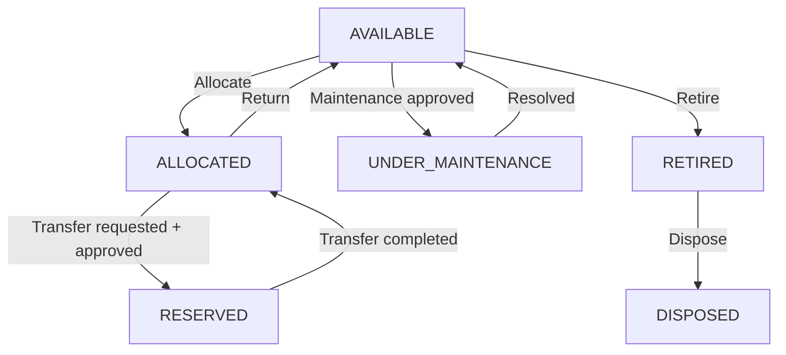
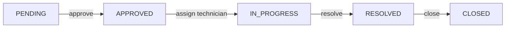

# Business Rules, State Machines & Concurrency

## Asset lifecycle state machine



Valid transitions only — enforce as an explicit allow-list in the service layer,
e.g. a `Map<AssetStatus, Set<AssetStatus>>` of legal next-states, checked before
every status write:

```java
private static final Map<AssetStatus, Set<AssetStatus>> VALID_TRANSITIONS = Map.of(
    AssetStatus.AVAILABLE,        Set.of(ALLOCATED, UNDER_MAINTENANCE, RETIRED),
    AssetStatus.ALLOCATED,        Set.of(AVAILABLE, RESERVED),
    AssetStatus.RESERVED,         Set.of(ALLOCATED),
    AssetStatus.UNDER_MAINTENANCE,Set.of(AVAILABLE),
    AssetStatus.RETIRED,          Set.of(DISPOSED),
    AssetStatus.DISPOSED,         Set.of()
);
```
Any transition not in this map throws `InvalidStateTransitionException` → 400.

## Double-allocation prevention

- **Service-level check** (produces the friendly error): before creating an
  allocation, query for an existing row in `allocations` with
  `asset_id = :assetId AND status = 'ACTIVE'`. If found, throw
  `AssetAlreadyAllocatedException` with the current holder's name, suggesting a
  transfer.
- **DB-level backstop**: the partial unique index
  `uq_allocations_one_active_per_asset` (see `01-DATABASE-SCHEMA.md`) guarantees
  correctness even under a race between two concurrent allocation requests — the
  loser's insert fails at the DB with a unique-violation, which the service
  catches and translates into the same friendly error.
- **Concurrency**: wrap the check-then-insert in a single `@Transactional`
  service method. Additionally take a pessimistic lock on the asset row
  (`SELECT ... FOR UPDATE`) at the start of the method so the check and the
  insert are atomic with respect to other transactions targeting the same
  asset — the unique index alone is a correctness backstop, the row lock is
  what avoids relying on catching a DB exception as the primary control flow.

```java
@Transactional
public AllocationResponseDTO allocate(AllocationRequestDTO dto) {
    Asset asset = assetRepository.findByIdForUpdate(dto.getAssetId()) // SELECT ... FOR UPDATE
        .orElseThrow(() -> new EntityNotFoundException("Asset not found"));

    if (asset.getStatus() != AssetStatus.AVAILABLE) {
        Allocation active = allocationRepository.findActiveByAssetId(asset.getId())
            .orElse(null);
        String holder = active != null ? active.getUser().getName() : "another workflow";
        throw new AssetAlreadyAllocatedException(
            "Asset " + asset.getAssetTag() + " is already allocated to " + holder
            + ". Consider a transfer request.");
    }

    // create allocation, transition asset to ALLOCATED, log activity
}
```

## Booking overlap prevention

Overlap predicate (two intervals `[startA, endA)` and `[startB, endB)` overlap
iff `startA < endB AND endB > startA`... more precisely, standard half-open
interval overlap test):

```sql
SELECT 1 FROM bookings
WHERE resource_id = :resourceId
  AND status IN ('PENDING','CONFIRMED')
  AND start_time < :newEnd
  AND end_time   > :newStart;
```

- Adjacent bookings are allowed: if `existing.end_time == new.start_time` there
  is no overlap (`end_time > newStart` is false when they're equal), so back-to-
  back bookings succeed — this is intentional, verify it in a test.
- Run this check inside the same transaction as the insert. For safety under
  concurrent booking attempts on the same resource, either (a) take an advisory
  lock keyed on `resource_id` for the duration of the transaction, or (b) accept
  a small race window and rely on re-checking, returning 409 to the loser if a
  second overlap check post-insert reveals a conflict. Option (a) is preferred
  for a hackathon demo because it's simpler to reason about and to explain to
  judges.
- Cancelling a booking sets `status = CANCELLED`, excluded from the overlap
  check going forward — do not hard-delete bookings, they're part of history.

## Transfer workflow

1. `POST /transfers` creates a row with `status = PENDING`. Valid only when the
   asset's current status is `ALLOCATED` and `from_user_id` matches the asset's
   current active allocation holder.
2. On approval (`PUT /transfers/{id}/approve`): in one transaction —
   - close the old `allocations` row (`status = RETURNED`)
   - create a new `allocations` row for `to_user_id`
   - set `transfers.status = APPROVED`
   - asset status stays `ALLOCATED` throughout (never drops to `AVAILABLE`
     mid-transfer) — this is why the state diagram shows `RESERVED` as a
     transient marker rather than routing back through `AVAILABLE`.
3. On rejection: `transfers.status = REJECTED`, nothing else changes.
4. History is append-only: never update or delete a prior `allocations` row's
   holder — close it and open a new one, so `GET /allocations?assetId=` returns
   full provenance.

## Return workflow

1. `POST /returns` valid only for the allocation's current holder (or an
   authorized approver on their behalf) and only while `allocations.status =
   ACTIVE`.
2. On success: create `returns` row, set `allocations.status = RETURNED`, asset
   transitions `ALLOCATED → AVAILABLE`.

## Maintenance workflow



- On `APPROVED`: asset transitions to `UNDER_MAINTENANCE`.
- On `RESOLVED`: asset transitions back to `AVAILABLE`.
- Every transition writes a `maintenance_history` row (`status, updated_by,
  comment, timestamp`).
- Enforce the linear order strictly — e.g. `PUT /maintenance/{id}/status` with
  `RESOLVED` when the current status is `PENDING` (not yet `IN_PROGRESS`) is
  rejected with 400, not silently allowed.

## Audit workflow

- `audit_cycles.status`: `OPEN → CLOSED`, one-way.
- `audit_items.result` starts `PENDING`, settled to `VERIFIED` / `MISSING` /
  `DAMAGED` only by the auditor assigned to that specific item
  (`audit_items.auditor_id`) — not any auditor, not the cycle creator by default
  unless also assigned.
- On `PUT /audits/{id}/close`: reject (400) if any `audit_items.result =
  PENDING` remains, OR allow closing with a warning and mark unresolved items as
  implicitly `MISSING` — **pick one and document which**; recommended: reject
  closing until every item has a non-pending result, since a hackathon demo
  benefits from showing deliberate discrepancy handling rather than silent
  auto-resolution.
- Once `CLOSED`, all `audit_items` under that cycle become immutable — enforce
  in the service layer (check cycle status before allowing an item update) in
  addition to whatever UI-level read-only state the frontend shows.

## Validation & error message conventions

- Every request DTO uses Bean Validation: `@NotBlank`, `@Email`, `@Size`,
  `@Positive`, `@FutureOrPresent` (for dates like `expectedReturn`), etc.
- Field-level validation errors are aggregated by the global exception handler
  into one message, e.g.:
  `"Validation failed: email must be a valid email address; password must be at least 8 characters"`.
- Domain-rule violations get purpose-built exceptions with human-readable
  messages (see examples above) — never let a raw
  `DataIntegrityViolationException` or stack trace reach the client; catch it in
  `@ControllerAdvice` and translate to a generic "duplicate value" or "invalid
  reference" message based on the constraint name if you can determine it,
  otherwise a safe generic message.

## Soft delete & data integrity

- Departments: deleting is blocked (409) if any active user has that
  `dept_id`, or any child department exists — the client must reassign or
  delete children first.
- Asset categories: deleting is blocked (409) if any asset references it.
- Users: "deleting" a user sets `status = INACTIVE`; a deactivated user cannot
  log in (checked in `UserDetailsServiceImpl`) but their historical
  allocations/activity remain intact and queryable.
- Assets are never hard-deleted; "delete" from the API transitions the asset to
  `RETIRED` (see state machine) which is itself a terminal-ish status, not the
  generic `INACTIVE` flag.
